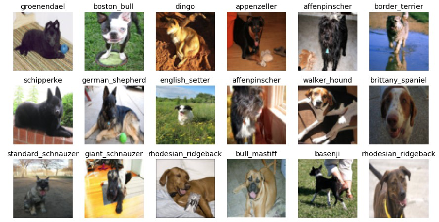

The repository contains a notebook, showing the user how to train a network using stanford-dog-classification dataset. Moreover, the repository shows how one can use Mlflow package to run experiments for testing different hyperparameters/architectures in for that task. Furthermore, Flask micro-framework has been used to provide a means of communication with the model to assess the prediction of the model via REST API.

You may also run Streamlit to check, how the model behaves, and provide your own images (just copy them to img folder) and provide them to the network to obtain accuracy.

## Data

The data consisting of 120 different breeds was, which can obtained [here](https://www.kaggle.com/c/dog-breed-identification). Moreover, the dataset was enhanced with images scraped from the web (particularly Bing, see [script](https://gist.github.com/SellersEvan/420aa58176e6aed3b043b034f010f2d5)) and additional breeds where added. For the time being, 122 different breeds were used to train the model, and more can be easily added. For the full list of breeds, [see] (https://github.com/wprazuch/dog-expert).  If you would like to access the dataset, please DM me.

## Methods
For dataset labelling and tracking, [DVC](https://dvc.org/) tool was used, as it provides convenient way of handling data for even small projects. The data is kept on Google Drive. If new images are added to the data, you can add them via DVC API, just as if you were adding new files in Git. If the dataset was modified, you can release a new version of it and you can push the data to the remote (in this case, Google Drive, but If you would like to access the data from different type of remote, you may see a full list [here](https://dvc.org/doc/command-reference/remote). Finally, you can pull different datasets versions, having full control over the data.

A deep learning model was used as an estimator and was written in Tensorflow. Breed classification can be done by API, or by using streamlit app, provided in the repository. For experiments, MLFlow was used to check common archuitectures and track their performances. Some analysis of the results was also provided.
